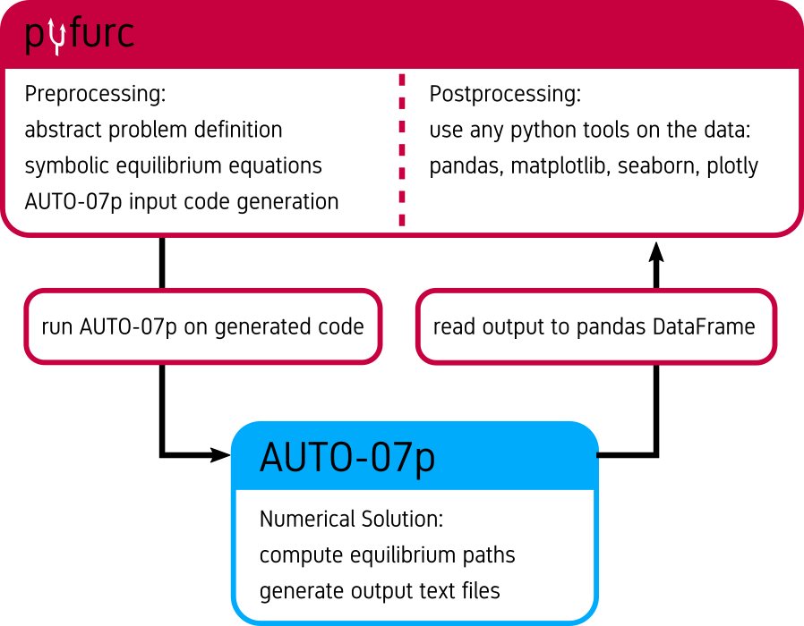
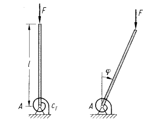
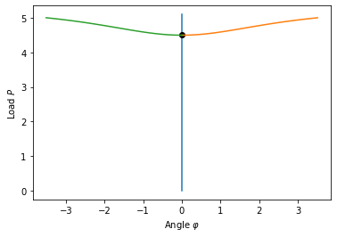

[][pypi-url]
[][ga-url]
[][rtd-url]


[pypi-url]: https://pypi.org/project/pyfurc/
[rtd-url]: https://pyfurc.readthedocs.io/en/latest/
[ga-url]: https://github.com/klunkean/pyfurc/actions/workflows/tests.yml
# What is pyfurc?

pyfurc is a python module that facilitates calculations for non-linear
mechanical systems exhibiting bifurcations with the generalized
path-following FORTRAN program [AUTO-07p](http://indy.cs.concordia.ca/auto/)
directly in python.

Energy expressions, degrees of freedom and loads are defined
using  [sympy](https://docs.sympy.org/latest/index.html)
symbolic math processing functionality, and equilibrium equations
are automatically derived symbolically.

pyfurc then generates FORTRAN code for the bifurcation problem,
calls the AUTO-07p routines and reads the result into a
[pandas](https://pandas.pydata.org/docs/user_guide/index.html) DataFrame
for post-processing in python.

The basic functionality looks like this:



## Solving a bifurcation problem can be this simple:

```python
import pyfurc as pf
import sympy as sp
import matplotlib.pyplot as plt

phi = pf.PhysicalQuantity("\\varphi", quantity_type="DOF")
P = pf.PhysicalQuantity("P", quantity_type="load")
cT = 10/3.1415
ell = 0.5

V = pf.Energy(1/2*cT*phi**2-P*ell*(1-sp.cos(phi)))
bf = pf.BifurcationProblem(V, name="hinged_cantilever")
bf.set_parameter("RL1", 12.73)  #set maximum load

solver = pf.BifurcationProblemSolver(bf)
solver.solve()  # solve problem

for dat in bf.solution.raw_data:
    plt.plot(dat["U(1)"], dat["PAR(1)"])
```

To get started, check out the Quickstart section below or check the
in-depth guides in the [Documentation](https://pyfurc.readthedocs.io/en/latest/).

# Quickstart

Prerequisites:

* Running Linux distribution (only tested on Ubuntu so far)
* Python 3.8.2+
* pip

For installing pyfurc run

```bash
pip3 install pyfurc
```

# Documentation

The [Documentation](https://pyfurc.readthedocs.io/en/latest/) is hosted on readthedocs.


<!-- ## 2.2 Testing
Open up a python 3 console and type `import pyfurc` if there is no error message the installation should have been successful.

# 3 Installing and using Jupyter-Notebook on WSL
This is optional but I really like jupyter-notebooks maybe you do too.

## 3.1 Installation
Open up a Ubuntu Terminal and run
```shell
pip3 install notebook
```
All done!

In the Ubuntu Terminal now run
```shell
jupyter notebook
```

The output should contain
```
http://localhost:8888/?token=xxxxxxxxxxxxxxxxxxxxxxxxxxxxxxxxxxxxxxxx
```
somewhere. Copy the part after `token=`, i.e. the `xxxxxx...` from above.

Now open your favorite browser in Windows and navigate to
```
127.0.0.1:8888
```
For future convenience set a password at the bottom of the page! Here you must supply the token we just copied.

Once you have set the password you're redirected to jupyter's landing page showing you the home directory of your Ubuntu file system (should be empty).

On the top right, click "new" -> "python3".

Now you have a jupyter notebook to play with. Type
```python
print("Hello World!")
```
in the first cell and hit Ctrl+Enter.

# 4 A first Example: Hinged cantilever

Consider the following system:



The total energy in the system is given by
```math
\begin{aligned}
V(\varphi) &= U(\varphi)-P\mathcal E(\varphi)\\&=\frac12 c_\mathrm{T}\varphi^2-F\ell\left(1-\cos\varphi\right)
\end{aligned}
```
## 4.1 Implementing this problem using pyfurc

First we import needed modules

```python
import pyfurc as pf
import sympy as sp
from math import pi
```
### 4.1.1 Defining physical quantities

Let us first define all contained variables as `pyfurc.PhysicalQuantity`.

It is important to set the `quantity_type` kwarg which may be one of `DOF`, `load` or `parameter`.

The `value` kwarg is optional (default=0.0) and will set the initial values if `quantity_type` is `DOF` or `load`, or the fixed constant value if `quantity_type` is `parameter`. The values can be changed later.


```python
phi = pf.PhysicalQuantity("\\varphi", quantity_type="DOF", value=0.0)
P = pf.PhysicalQuantity("P", quantity_type="load", value=0.0)
cT = pf.PhysicalQuantity("c_T", quantity_type="parameter", value=10/pi)
ell = pf.PhysicalQuantity("ell", quantity_type="parameter", value=0.5)
```

Next we define the energy expression using these quantites as a sympy expression. This is possible since `PhysicalQuantity` is a subclass of `sympy.Symbol`.

### 4.1.2 Defining the energy
First we define the energy as a symbolic expression `V_expr`
```python
V_expr = 1/2*cT*phi**2-P*ell*(1-sp.cos(phi))
```

To use this energy expression for the bifurcation analysis we create a `pyfurc.Energy` object from this expression:


```python
V = pf.Energy(V_expr)
```

We can print information about the energy:


```python
V.info()
```
Output:

    Potential energy with 1 DOF(s):
    -P*ell*(-cos(\varphi) + 1) + 0.5*\varphi**2*c_T

    The DOFs are:
    	\varphi - Fortran Name: U(1) - Init. Value: 0.000000
    The parameters are:
    	c_T - Fortran Name: PAR(2) - Value: 3.183099
    	ell - Fortran Name: PAR(3) - Value: 0.500000
    The load is:
    	P - Fortran Name: PAR(1) - Init. Value: 0.000000


Or directly access the information dicts `params`, `dofs` or `load`, e.g.:


```python
print(V.params)
```
Output:

    {c_T: {'name': 'PAR(2)', 'value': 3.183098861837907}, ell: {'name': 'PAR(3)', 'value': 0.5}}


The `pyfurc.Energy` class can also determine and output the equilibrium equations as symbolic objects:


```python
V.equilibrium()
```
Output:

```math
[ - P \ell \sin{\left (\varphi \right )} + 1.0 \varphi c_{T}]
```

The derivatives are calculated symbolically using sympy.

### 4.1.3 Defining the Bifurcation Problem

Now having defined a `pyfurc.Energy`, we use this energy to setup our bifurcation problem to be solved. Let us initialize a `pyfurc.BifurcationProblem` with the name `hinged`. The name will be used for the AUTO files.


```python
bf = pf.BifurcationProblem(V, name="hinged")
```

The problem class contains all calculation parameters which can be printed as follows:


```python
bf.print_parameters()
```
Output:

    NTST	: 50
    IAD	: 3
    EPSL	: 1e-07
    EPSU	: 1e-07
    EPSS	: 1e-05
    ITMX	: 8
    ITNW	: 5
    DS	: 0.1
    DSMIN	: 0.001
    DSMAX	: 0.2
    IADS	: 1
    STOP	: []
    NMX	: 200
    RL0	: 0.0
    RL1	: 0.0
    MXBF	: 10
    NPR	: 200
    IID	: 2
    IPLT	: 0
    UZR	: {}
    UZSTOP	: {}


Refer to the AUTO documentation for detailed descriptions of the parameters. The names are identical with the names used in the AUTO `c.xxx` file

To change a parameter we use the `set_parameter(name, value)` method. For example we set the maximum load `RL1`, as above, to a value of `12.73`:


```python
bf.set_parameter("RL1", 12.73)
```
### 4.1.4 Defining the solver

Having defined the problem we can instantiate a `BifurcationProblemSolver` object which handles the AUTO code generation and execution.


```python
solver = pf.BifurcationProblemSolver(bf)
```

To solve the problem we call the `solve()` method:


```python
solver.solve()
```

Output:

    Running AUTO on problem hinged
    ------------------------------------------------------------------------
    gfortran -fopenmp -O -c hinged.f90 -o hinged.o
    gfortran -fopenmp -O hinged.o -o hinged.exe /home/andre/localtu/prog/auto/07p/lib/*.o
    Starting hinged ...

      BR    PT  TY  LAB    PAR(1)        L2-NORM         U(1)
       1     1  EP    1   0.00000E+00   0.00000E+00   0.00000E+00
       1    33  BP    2   6.36620E+00   0.00000E+00   0.00000E+00
       1    65  EP    3   1.27662E+01   0.00000E+00   0.00000E+00

      BR    PT  TY  LAB    PAR(1)        L2-NORM         U(1)
       2    59  EP    4   1.28314E+01   1.90442E+00   1.90442E+00

      BR    PT  TY  LAB    PAR(1)        L2-NORM         U(1)
       2    59  EP    5   1.28314E+01   1.90442E+00  -1.90442E+00

     Total Time    0.628E-02
    hinged ... done

    ------------------------------------------------------------------------


The `BifurcationProblem` we just solved now has an attribute `solution` which (for now) only contains raw data we can plot manually (you need to install `matplotlib` for this: `pip3 install matplotlib`)


```python
import matplotlib.pyplot as plt
for dat in bf.solution.raw_data:
    plt.plot(dat["U(1)"], dat["PAR(1)"])
```

Output:




The post-processing capabilities are to be extended soon.

## 4.2 Summary and whole code

This is what we have done:

* Define `PhysicalQuantity` objects and set values
* Define `Energy` Object
* Define `BifurcationProblem` object and set parameters
* Define `BifurcationProblemSolver` object and call `solve` method
* Plot results from `BifurcationProblem.solution`

## 4.3 Runnable Code:
```python
import pyfurc as pf
import sympy as sp
from math import pi
import matplotlib.pyplot as plt

# Physical quantities
phi = pf.PhysicalQuantity("\\varphi", quantity_type="DOF", value=0.0)
P = pf.PhysicalQuantity("P", quantity_type="load", value=0.0)
cT = pf.PhysicalQuantity("c_T", quantity_type="parameter", value=10/pi)
ell = pf.PhysicalQuantity("ell", quantity_type="parameter", value=0.5)

# Energy
V_expr = 1/2*cT*phi**2-P*ell*(1-sp.cos(phi))
V = pf.Energy(V_expr)

# BifurcationProblem
bf = pf.BifurcationProblem(V, name="hinged")
bf.set_parameter("RL1", 12.73)  #set maximum load

# BifurcationProblemSolver
solver = pf.BifurcationProblemSolver(bf)
solver.solve()  # solve problem

# Plot solution (manually)
for dat in bf.solution.raw_data:
    plt.plot(dat["U(1)"], dat["PAR(1)"])
```

Output

    Running AUTO on problem hinged
    ------------------------------------------------------------------------
    gfortran -fopenmp -O -c hinged.f90 -o hinged.o
    gfortran -fopenmp -O hinged.o -o hinged.exe /home/andre/localtu/prog/auto/07p/lib/*.o
    Starting hinged ...

      BR    PT  TY  LAB    PAR(1)        L2-NORM         U(1)
       1     1  EP    1   0.00000E+00   0.00000E+00   0.00000E+00
       1    33  BP    2   6.36620E+00   0.00000E+00   0.00000E+00
       1    65  EP    3   1.27662E+01   0.00000E+00   0.00000E+00

      BR    PT  TY  LAB    PAR(1)        L2-NORM         U(1)
       2    59  EP    4   1.28314E+01   1.90442E+00   1.90442E+00

      BR    PT  TY  LAB    PAR(1)        L2-NORM         U(1)
       2    59  EP    5   1.28314E+01   1.90442E+00  -1.90442E+00

     Total Time    0.530E-02
    hinged ... done

    ------------------------------------------------------------------------

# pyfurc roadmap:

* Add support for continuous systems (Ritz)
* Automatic assembly of the Hessian, symbolic determination of critical points
* Automatic evaluation of the stability of equilibrium paths
* Expand postprocessing capabilities -->
