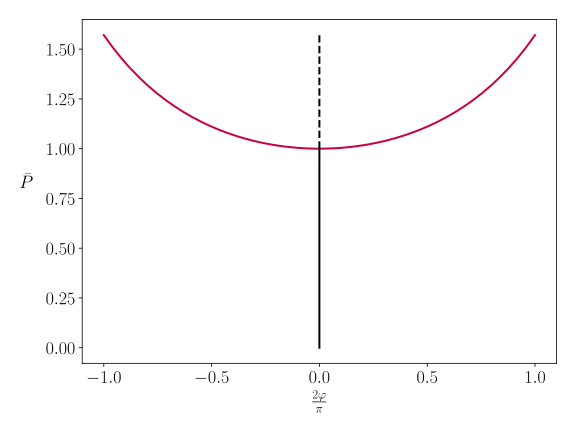
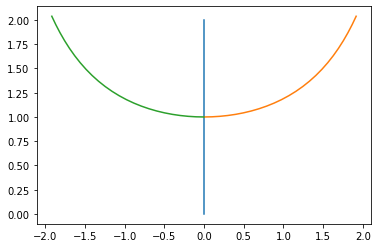

An Introduction to Elastic Stability and pyfurc -- A Tutorial
+++++++++++++++++++++++++++++++++++++++++++++++++++++++++++++

This tutorial first explains some mechanical and mathematical background
and thereafter demonstrates the basic usage of pyfurc by solving one of
the simplest example problems in elastic stability.

Problem: The Hinged Cantilever
------------------------------

Consider the rigid cantilever with length :math:`\ell` shown below.
On the top end it is subject to a dead load :math:`P`. On the bottom
end there is a simple support as well as a torsional spring with
stiffness :math:`c_T`.

    Fig. 1: Hinged Cantilever

The angle :math:`\varphi` measures the rotation of the cantilever
with respect to the vertical axis.

Our first aim is to find a relationship between the load :math:`P` and
the cantilever rotation :math:`\varphi`.

1. The Introductory Mechanics Approach
======================================

The moment equilibrium taken in the deflected position
(shown right in the figure above) dictates that

.. math::

    P\ell\sin\varphi-c_\mathrm{T}\varphi=0\,.

We now have the task to find all valid tuples :math:`(P,\varphi)`
which satisfy the above equation. We constrain ourselves to the
sensible choice :math:`0\leq|\varphi|\leq\frac\pi2`.

Apparently, for :math:`\varphi=0`
we can choose an arbitrary value for :math:`P` and the equilibrium
condition is satisfied. This corresponds to the trivial,
non-deflected solution and we will later see that this equilibrium
state is only stable up to a certain point.

For :math:`\varphi\neq0` let us set
:math:`\bar P=\frac {P\ell}{c_\mathrm{T}}` such that the
relation becomes

.. math::

    \bar P = \frac\varphi{\sin\varphi}\,.

With this expression we have fulfilled our task of finding tuples that
satisfy the equilibrium condition. These solutions are also called
equilibrium paths and are plotted below:

    Fig. 2: Equilibrium paths of the hinged cantilever system:
    The red curve corresponds to the non-trivial solutions, the black
    curve to the trivial solution.

As we can see, for :math:`\bar P>1` we have multiple possible
solutions for :math:`\varphi`. Graphically we can identify
:math:`\bar P=1` as a *critical point* or *bifurcation point*. When
continually loading the system from zero load, the path it takes after
reaching :math:`\bar P=1` is non-unique. Both paths are mechanically equally
valid and admissible as they both satisfy the equilibrium condition. In
reality, small imperfections, e.g. deviations in the angle of the applied
load, bearing friction, a not perfectly straight cantilever etc. will
always nudge the system into taking a preferred equilibrium path.

Systems like this, which do not have a unique solution for a given
input are not easily tackled computationally. Standard algorithms
may find only one of many solution paths or never converge to a
solution at all. Of course in this simple problem we were able to find
the solutions analytically but this surely is not the case for most systems.

This is where the FORTRAN program `AUTO-07p` comes
into play in which sophisticated algorithms that can handle
non-uniqueness, bifurcations and unstable solutions are implemented and
allow for numerical solutions of such systems with bifurcations.

Pyfurc facilitates this functionality. But before diving in, let us
introduce a more systematic approach to elastic systems than
taking the Newton equilibrium equations.

2. The Total Potential Energy Method
====================================

This section will give a brief introduction to the total potential
energy (TPE) method which provides a way to systematically tackle a
broad class of elastic systems.
For more a more in-depth introduction we recommend the
book by Thompson & Hunt (1973)\ :footcite:p:`thompson1973general`.

The total potential energy :math:`V` of an elastic system is given by
an internal potential energy :math:`U` minus the work done by external
forces. We restrict ourselves to systems which are subject to only one
load :math:`P`. This load does work along a path :math:`\Delta`. The
internal energy as well as the path :math:`\Delta` may be functions
of the degrees of freedom :math:`Q_i` of the system.

Thus the TPE takes the following general form:

.. math::
    V(Q_i, P)=U(Q_i)-P\Delta(Q_i)\,.

|

 .. note:: Before you continue...

    What is the only degree of freedom in our example system?

    Try figuring out the TPE of the hinged cantilever.

The TPE method relies on the following two axioms:

- **Axiom 1**:

  A stationary value of the total potential energy with respect to the
  generalized coordinates is necessary and sufficient for the
  equilibrium of the system.

- **Axiom 2**:

  A complete relative minimum of the total potential energy with respect
  to the generalized coordinates is necessary and sufficient for the
  stability of an equilibrium state.

.. .. note::
..     We cannot give a thorough introduction to the notion of stability
..     at this point.
..     Intuitively speaking: A system in a stable equilibrium state will
..     return to this state after a small excitation. An upright pendulum
..     is an example for an unstable equilibrium state.

Equilibrium
###########

Mathematically the first axiom translates to

.. math::
    \frac{\partial V}{\partial Q_i} = 0 \quad\Leftrightarrow\quad \textrm{Equilibrium}.

Thus, to find equilibrium states of a system we need to

1. identify/define the degrees of freedom,
2. formulate the TPE expression
3. and take its first derivatives w.r.t. all degrees of freedom.

The result is a set of equations (as many as there are
degrees of freedom), the solutions of which correspond to all
equilibrium states of the system.

Let us perform these three steps for our example system from above:

1. The system has only one degree of freedom, the bottom support
   restricts translatory movement in horizontal and vertical
   direction but allows for rotational movement. The
   sensible choice is setting :math:`Q_1=\varphi`.
2. We neglect gravitational potential energy and find that the only
   potential energy in the system is inside the torsional spring,
   thus:

   .. math::
       U(\varphi) = \frac12c_\mathrm{T}\varphi^2

   The force :math:`P` does work along the displacement

   .. math::
       \Delta(\varphi) = \ell(1-\cos\varphi)

   Combining these results gives the TPE

   .. math::
       V(\varphi, P) = \frac12c_\mathrm{T}\varphi^2-P\ell(1-\cos\varphi)

3. Taking the derivative w.r.t to all degrees of freedom, i.e.
   :math:`\varphi`, and applying the first axiom yields:

   .. math::
       \frac{\partial V}{\partial\varphi} = c_\mathrm{T}\varphi - P\ell\sin\varphi=0

The above result is exactly the same equilibrium equation we found by
using Newton's equation of motion. But we got there through a more
systematic approach which
translates well to more complicated systems with more degrees of
freedom.

Stability
#########

The second axiom states that for an equilibrium state to be stable
it has to be a local minimum. Mathematically we can assert this by
taking a Taylor series expansion about an equilibrium state.

Let us suppose we have found an equilibrium state :math:`\bar Q` of
a system with one degree of freedom :math:`Q` using
the above method.
The change in energy
when altering the equilibrium state :math:`\bar Q` by a small amount
:math:`\varepsilon` then reads

.. math::
    V(\bar Q+\varepsilon)-V(\bar Q)=
    \frac1{2!}\frac{\partial^2 V}{\partial Q^2}\bigg|_{Q=\bar Q}\varepsilon^2
    + \frac1{3!}\frac{\partial^3 V}{\partial Q^3}\bigg|_{Q=\bar Q}\varepsilon^3
    + \frac1{4!}\frac{\partial^4 V}{\partial Q^4}\bigg|_{Q=\bar Q}\varepsilon^4+\ldots

Note that the first derivative is missing in the expression above since
for an equilibrium state it has to vanish according to axiom 1. We are
also omitting the load parameter :math:`P` for brevity.

Now for :math:`V(\bar Q)` to be a minimum, i.e. for :math:`\bar Q`
to be a **stable equilibrium** state after axiom 2,
the above change in energy has to be positive for any
:math:`\varepsilon`.
This means that the first nonzero term in the series expansion must be
positive for any :math:`\varepsilon`. It thus has to be a term with an
even power of :math:`\varepsilon` and a positive corresponding
coefficient.

If the whole series is zero the equilibrium is called
**neutrally stable**. Any other case is called an
**unstable equilibrium**.

If only

.. math::
    \frac{\partial^2 V}{\partial Q^2}\bigg|_{Q=\bar Q}=0

in an equilibrium state :math:`\bar Q` then the energy function
is locally flat. This implies a change in the system's stability and
is called **singular**, **critical** or **bifurcation** point.

Now let us check the stability for the equilibrium states of our example
system. To this end, we start by analyzing the first even order derivative:

.. math::
    \frac{\partial^2 V}{\partial \varphi^2} = 1-\bar P\cos(\varphi)

Obviously, for :math:`\bar P<1` this expression is positive for arbitrary
values of :math:`\varphi`.
Thus, our trivial equilibrium path where :math:`\varphi=0`,
is stable up to :math:`\bar P = 1` where the second derivative becomes zero.
For :math:`\bar P > 1` the second derivative is negative and thus,
the trivial
equilibrium states are unstable for :math:`\bar P>1`. We marked these
unstable states
with a dashed line in the diagram in Fig. 2 whereas solid lines show the
stable equlibrium states.

Now for the non-trivial equilibrium solutions

.. math::
    \bar P =\frac{\varphi}{\sin\varphi}\,.

Plugging these into the expression for the second derivative gives

.. math::
    \frac{\partial^2 V}{\partial Q^2}\bigg|_\mathrm{eq.}=1-\frac{\varphi}{\tan\varphi}

which is always positive for our chosen interval of
:math:`0\leq|\varphi|\leq\frac\pi2`. All these equilibrium states are thus
stable.

Take a look at the figure below where the TPE function :math:`V(\varphi, \bar P)`
is plotted over the normalized angle :math:`\frac{2\varphi}\pi` and the
normalized load :math:`\bar P = \frac{P\ell}{c_\mathrm{T}}`. It should be
clear why :math:`V` is sometimes called *energy surface* or *energy landscape*

On this energy surface, the equilibrium states we found earlier are plotted.
The figure is *interactive*! Hovering over the energy surface will show
you the function :math:`V(\varphi)` for a fixed value of :math:`\bar P`
as a dark blue line across the energy surface. On these curves you can clearly see
the local minima the stable equilibrium paths pass through as well as the
local maxima the unstable path passes through. You can also observe the
locally flat surface at the critical point :math:`\bar P = 1`.

Take a little time to play around with the visualization, rotate the graph,
zoom in and out to identify the observations stated above.

.. raw:: html
   :file: ../_static/plotly_graphics/hinged_energy_graph.html

.. Energy surface :math:`V(\varphi, \bar P)` for the Hinged Cantilever

Note that we did not provide a numeric scale for the values of the
energy function. This is because the absolute value of the TPE has no
influence on the mechanical behaviour of the system. Recall that it is
only the derivatives that are relevant for the mechanical response, i.e.
equilibrium and stability.

Also note that a visualisation like this is only possible for systems with
exactly one degree of freedom subject to exactly one load.
Only then a surface can be plotted as a function of the degree of
freedom and the load parameter.

3. Numerical Solution with pyfurc
=================================

Let us recap what we had to do to find the equilibrium states of
our example system using the TPE method:

1. Identify/define the degrees of freedom,
2. formulate the TPE expression
3. and take its first derivatives w.r.t. all degrees of freedom to obtain
   the equilibrium equations.
4. Find all states that satisfy the equilibrium equations.

Pyfurc takes over after step 2. Based on a provided expression for the TPE
pyfurc determines the equilbrium equations and solves them via AUTO-07p.

For this example system we could obtain
the solutions analytically and finding the equilibrium equations was a
trivial task. But for more complicated systems, obtaining analytical
solutions may be impossible and determining the equilibrium equations may
become tedious.

.. note::
    If you already have installed pyfurc you can just follow along and
    try everything out yourself, preferrably in a jupyter notebook. Otherwise go
    to :ref:`this page<Installing pyfurc on Ubuntu>` for installation
    instructions.

We have already gone through steps 1 and 2 above: Our only degree of
freedom is :math:`\varphi` and our TPE reads

.. math::
    V(\varphi, P) = \frac12 c_\mathrm{T}\varphi^2-P\ell(1-\cos\varphi)\,.

The first thing we do is import pyfurc and sympy. The latter is a symbolic
math package for python and enables us to define the TPE as
a symbolic expression.

.. code-block:: python

    import pyfurc as pf
    import sympy as sp

We can now define the degree of freedom :math:`\varphi` as ``pf.Dof``,
the load :math:`P` as ``pf.Load`` as well as the constants :math:`c_T`
and :math:`\ell` as simple floating point numbers.

.. code-block:: python

    phi = pf.Dof("\\varphi")
    P = pf.Load("P")
    c_T = 1
    ell = 1

The only argument we have to supply inside the brackets
is the name the variable has for display purposes.
Since the backslash is reserved as a special character in python strings we
have to escape it using another backslash. The strings we supplied can be
rendered using LaTeX, which is why we called our dof ``\\varphi``.

If you are inside a jupyter notebook you can run ``display(phi)`` and
it should output a rendered phi.

With the above quantities defined we can define the energy expression using

.. code-block:: python

    V = pf.Energy(1/2*c_T*phi**2 - P*ell*(1-sp.cos(phi)))

Note that we use the ``cos`` function supplied by ``sympy`` which we imported
above as ``sp``. The only argument for :class:`pf.Energy <pyfurc.core.Energy>`
is the expression.

Recall that when solving the problem manually we would now determine the
equilibrium equations by calculating the first derivatives.
In pyfurc we instead define a :class:`pf.BifurcationProblem <pyfurc.core.BifurcationProblem>`
as follows:

.. code-block:: python

    bf = pf.BifurcationProblem(V, name="hinged_cantilever")

The first (mandatory) argument here is the energy expression ``V``.
The second argument is an optional keyword argument that is used to
name output files.

The ``pf.BifurcationProblem`` object holds parameters and settings for
the calculation. One important parameter is called ``RL1`` (by AUTO-07p)
which is the maximum load up to which the calculation is carried out.
For our choice of constants, setting this to ``2.0`` is sensible
(can you give a reason why this is the case?):

.. code-block:: python

    bf.set_parameter("RL1", 2.0)

The rest of the parameters inside the ``pf.BifurcationProblem``
is kept at default values which can be found :class:`here<pyfurc.util.AutoParameters>`.

The last step is to define and run the solver:

.. code-block:: python

    solver = pf.BifurcationProblemSolver(bf)
    solver.solve()

If ``solver.solve()`` has run successfully, you will get a console output
by AUTO-07p which has been called in the background. More importantly,
our ``BifurcationProblem`` now holds the solutions as a list of
:class:`pandas DataFrames<pandas:pandas.DataFrame>` inside
``bf.solution.raw_data``. Each list item corresponds to a single equilibrium
branch.

We can create a very rudimentary plot with the following lines:

.. code-block:: python

    import matplotlib.pyplot as plt
    for branch in bf.solution.raw_data:
        plt.plot(branch["U(1)"], branch["PAR(1)"])

In the lines above we iterate over the DataFrames in ``bf.solution.raw_data``
and plot their
respective ``U(1)`` (i.e. the first DOF in AUTO-07p nomenclature) and
``PAR(1)`` (i.e. the first load parameter in AUTO-07p nomenclature)
columns using `matplotlib <https://matplotlib.org/>`_. The resulting plot
should look more or less like this:

    Fig. 3: Rudimentary Bifurcation Plot

If you prefer to work with the actual raw data output by AUTO-07p, a
directory with the name of the ``BifurcationProblem`` and a timestamp
should have been created inside the directory where you have run your
python script. In this case, the directory is called ``hinged_cantilever_YYYYMMDD_HHMMSS``
and you can find the generated FORTRAN code ``hinged_cantilever.f90``
and its compiled executable, the output files ``fort.7``, ``fort.8``
and ``fort.9`` as well as the constants file ``c.hinged_cantilever``
inside.

The complete code for the above example looks as follows:

.. code-block:: python

    import pyfurc as pf
    import sympy as sp
    import matplotlib.pyplot as plt

    phi = pf.Dof("\\varphi")
    P = pf.Load("P")
    c_T = 1
    ell = 1

    V = pf.Energy(1/2*c_T*phi**2 - P*ell*(1-sp.cos(phi)))
    bf = pf.BifurcationProblem(V, name="hinged_cantilever")
    bf.set_parameter("RL1", 2.0)

    solver = pf.BifurcationProblemSolver(bf)
    solver.solve()

    for branch in bf.solution.raw_data:
        plt.plot(branch["U(1)"], branch["PAR(1)"])

Congratulations! You have successfully solved your first bifurcation
problem with pyfurc!

Literature
==========

.. footbibliography::
